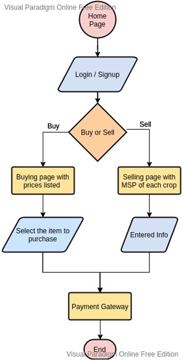

### Team Members

- Ramankur Goswami
- Shivam Purohit 
- Pranjal Srivastava

### Track Choosen - Open Innovation

### Problem Statement

Due to changing farm laws and regulations, farmers across the country are facing the following issues ->

- Lack of proper regulated channels for buying and selling.
- Lack of awareness among farmers about market prices.
- Non enforcement of government rules.
- Middle-man mediation

We are trying to solve the above by using a web app built for farmers to sell crops and buy equipments without any middle-man mediation and create a independent, fully-virtual marketplace.

### Methodology

**KisaanVend** is a webapp through which farmers can sell crops to and buy equipment directly from other merchants without any third-party mediation.
 
To avoid price inflation and maintain regularised selling, the app validates any purchase through the use of MSP for pricing and the buyer must adhere to it.
 
The app also incorporate payment authentication which help both parties avoid extra middleman costs and helps in creating of a virtual market space to empower both the buyer and seller.

#### Flowchart

### HOW ARE WE DIFFERENT FROM OTHERS

We are creating a safe, regulated and fully virtual platform which acts as a self-independent marketplace exclusively for farmers. 

Through the use of MSP, we are making farmers aware of the true market value for their goods and help him/her in creating a stronger negotiating position for self.

### Tech Stack

1. React - Frontend
2. Firebase - Backend & DBMS
3. Material-UI – Visual Customization

### Challenges Faced

1. Since we are mostly focussed currently on building the web app, the other business model problems such as Logistics and Transport have not been completely feasibly sorted out. We are trying to solve the above by creating a business model plan in the near future. 

2. Currently we do not have access and authorization to the government API for real time updation of the MSP. So we are updating it manually from publically available official government pricelist for validation (Link - https://pib.gov.in/PressReleaseIframePage.aspx?PRID=1657457).

